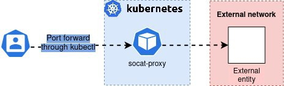

# tf-k8s-socat

Module to implement socat in Kubernetes through Terraform.

## Usage:

```hcl-terraform
module "socat" {
  source           = "git@github.com:glaaj/tf-k8s-socat.git"
  version          = 1.0.0
  namespace        = "insertnamehere"
  endpoint         = "inserturlhere"
  destination_port = xxx
  source_port      = xxx
  protocol         = "TCP"
}
```

## Why

Use the pods that the deployment creates to troubleshoot networking towards targets that may only be accessible from sources inside a cluster. For example a database that only allows connectivity from the cluster.

### Visual representation



<!-- BEGIN_TF_DOCS -->
## Requirements

| Name | Version |
|------|---------|
| <a name="requirement_terraform"></a> [terraform](#requirement\_terraform) | >= 1.7.0 |
| <a name="requirement_kubernetes"></a> [kubernetes](#requirement\_kubernetes) | > 2.0.0, < 3.0.0 |
| <a name="requirement_random"></a> [random](#requirement\_random) | > 3.0.0, < 4.0.0 |

## Providers

| Name | Version |
|------|---------|
| <a name="provider_kubernetes"></a> [kubernetes](#provider\_kubernetes) | > 2.0.0, < 3.0.0 |
| <a name="provider_random"></a> [random](#provider\_random) | > 3.0.0, < 4.0.0 |

## Modules

No modules.

## Resources

| Name | Type |
|------|------|
| [kubernetes_deployment.this](https://registry.terraform.io/providers/hashicorp/kubernetes/latest/docs/resources/deployment) | resource |
| [random_pet.this](https://registry.terraform.io/providers/hashicorp/random/latest/docs/resources/pet) | resource |

## Inputs

| Name | Description | Type | Default | Required |
|------|-------------|------|---------|:--------:|
| <a name="input_destination_port"></a> [destination\_port](#input\_destination\_port) | Port to which socat should forward the traffic. | `number` | n/a | yes |
| <a name="input_endpoint"></a> [endpoint](#input\_endpoint) | Address to which socat should forward traffic. | `string` | n/a | yes |
| <a name="input_namespace"></a> [namespace](#input\_namespace) | Name of the namespace in which the deployment should be placed. | `string` | `"default"` | no |
| <a name="input_protocol"></a> [protocol](#input\_protocol) | The protocol that socat should use, options are 'TCP' or 'UDP', defaults to TCP. | `string` | `"TCP"` | no |
| <a name="input_source_port"></a> [source\_port](#input\_source\_port) | Port on which socat should listen for traffic. | `number` | n/a | yes |

## Outputs

No outputs.
<!-- END_TF_DOCS -->